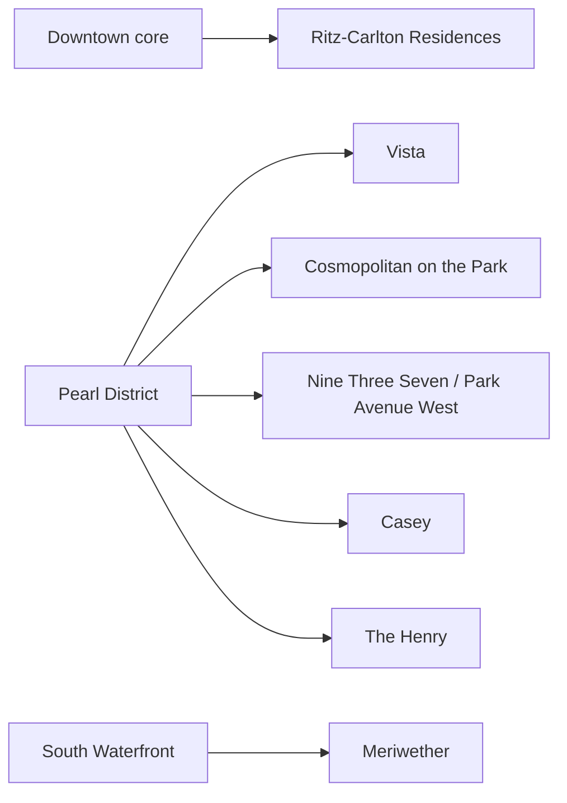
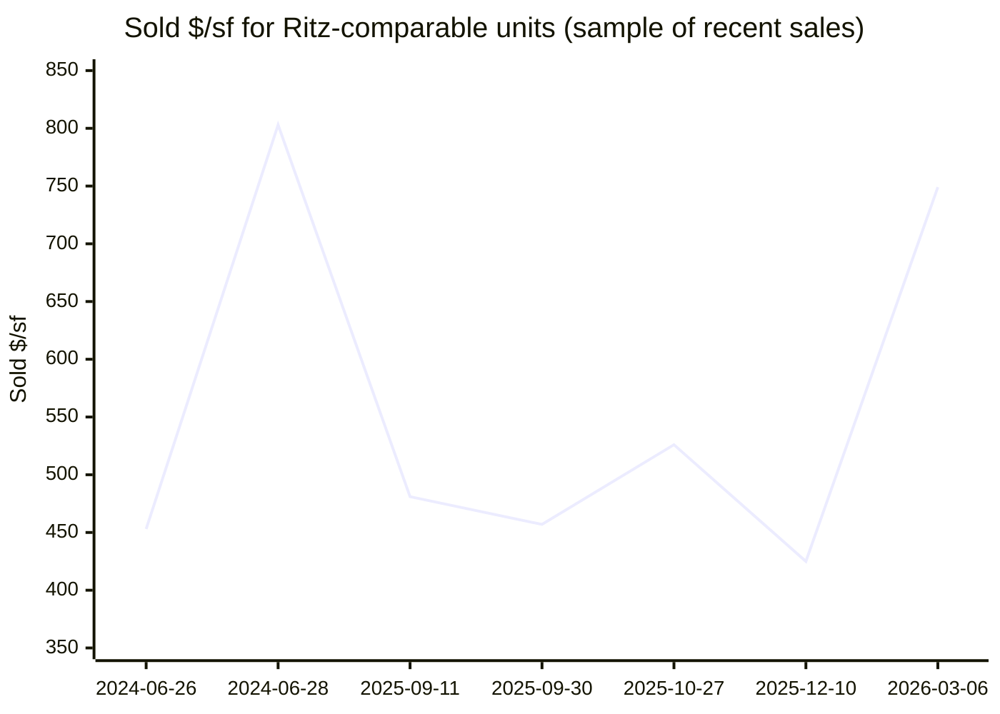
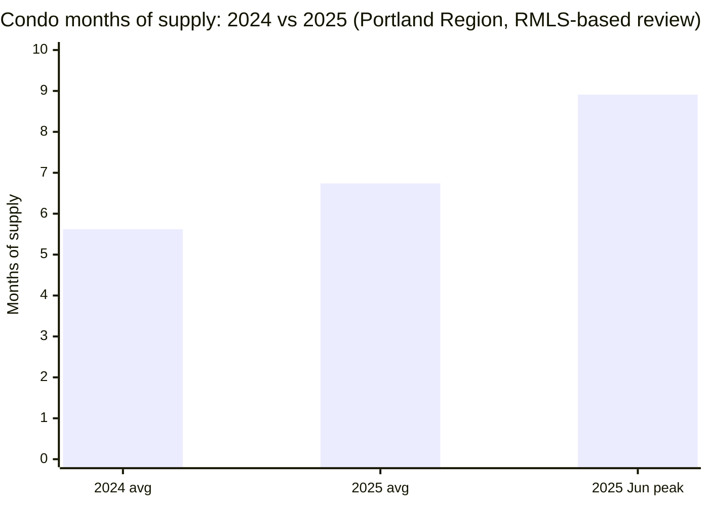

# Downtown Portland High-End Condo Market Analysis for Ritz-Comparable Units

## Executive summary

This report evaluates the downtown Portland high-end condo market through the lens of a “brand-new Ritz-comparable” unit: roughly 1,600 sq ft with 2–3 bedrooms, in a full-service luxury building. The baseline used here is a 2 bed / 3 bath, 1,673 sq ft **new-construction** unit at **The entity["point_of_interest","The Ritz-Carlton Residences, Portland","Portland, OR, US"]** listed at **$1,235,000 ($738/sf)** with **$2,467/month HOA** and **$15,015/year property taxes (2025)**. citeturn40view3turn40view2turn40view5turn2view3

Across a curated set of 9 additional comparables (active + sold) in Downtown, the entity["point_of_interest","Pearl District","Portland, OR, US"], and entity["point_of_interest","South Waterfront","Portland, OR, US"], the pricing picture is sharply segmented:

- **Non–ultra-luxury full-service resales (2004–2008 vintage towers) are clearing around ~$425–$526/sf** in recent 2025 sales (sample), often after meaningful price reductions and long exposure (roughly 118 days median marketing time in the resale sample). citeturn39view5turn38view4turn38view7turn39view9turn16view0  
- A **Ritz Residence sale in early March 2026** (2/3, 1,670 sf) closed at **$1,250,000 ($749/sf)** after being listed at the same price only days earlier—evidence that *correctly positioned* branded new construction can transact quickly even in a slower condo environment. citeturn34view0turn34view3  
- **Carrying costs are a defining differentiator**. The Ritz baseline shows **HOA dues around $2,467–$2,504/month (~$1.48–$1.50 per sf per month)**—materially higher than many nearby luxury resales (often ~$1,275–$1,738/month in this sample). citeturn40view2turn34view3turn39view0turn38view8turn39view3

Macro and local indicators align with **buyer leverage in condos**:

- Regional condo conditions in 2025 (RMLS-based analysis) showed **median price down ~3% YoY**, **PPSF down ~3.5%**, **average cumulative days on market up ~32%**, and **average months of supply up to ~6.74**—squarely “buyer-favored” by common industry thresholds. citeturn31view0  
- Neighborhood-level signals: Downtown Portland is shown as a **buyer’s market** with **~97.2% sale-to-list** and **~130 days average DOM** (Redfin neighborhood trend snapshot). citeturn33view0turn41search28  
- Financing headwind is real but easing: entity["company","Freddie Mac","us mortgage enterprise"] reports the **30-year fixed mortgage averaged ~6.00% as of March 5, 2026** (vs ~6.63% a year earlier). citeturn41search0turn41search18 entity["company","Fannie Mae","us housing finance enterprise"] has publicly forecast mortgage rates ending **2026 around ~5.9%** (September 2025 outlook). citeturn41search1

The “Ritz premium” is therefore best understood as a combination of **brand/service package + newness + (often) higher HOA**, rather than simply square footage or bed count. In negotiation, “comps” are still powerful—but you must adjust for **service level, building age, HOA structure, and buyer profile**.

## Scope and methodology

The analysis is built from three layers of evidence:

1. **Unit-level comparables (primary unit inputs)** drawn from publicly accessible listing detail pages on entity["company","Redfin","real estate brokerage"] that explicitly cite **entity["organization","Regional Multiple Listing Service","mls portland or"]** as the data source for many Portland-area listings. These pages provide list/sale history, HOA dues and “association amenities” (what HOA covers), taxes, parking fields, and narrative remarks where available. citeturn2view3turn34view0turn13view3turn39view5  
2. **Market-level context** using an RMLS-based condominium annual review from entity["organization","Portland Appraisal Blog","real estate appraisal blog"] (2024 vs 2025 changes in median price, PPSF, DOM, HOA dues, months of supply). citeturn31view0  
3. **Rate/affordability frame** from Freddie Mac and related public time series (with a directional rate outlook from Fannie Mae). citeturn41search0turn41search1turn41search18  

Selection rules for “Ritz-comparable” units:

- Condo units roughly **1,500–1,720 sq ft** (centered on ~1,600 sq ft)  
- **2-bed / 2+ bath** (some 2/3 layouts included, consistent with luxury inventory)  
- **Downtown / Pearl / South Waterfront** high-rise product where HOA is meaningful and amenities are a material part of value  
- Mix of **active listings and recent sales** to show both “ask” and “clear” prices  
- When data is not present in sources (e.g., seller concessions, special assessments beyond disclosed fees), it is stated as **Unspecified**.

Comparable buildings referenced (each appears later in the tables): entity["point_of_interest","Vista Condominiums","Portland, OR, US"], entity["point_of_interest","Cosmopolitan on the Park","Portland, OR, US"], entity["point_of_interest","Park Avenue West","Portland, OR, US"] (also labeled “Nine Three Seven Condominiums” in tax legal descriptions), entity["point_of_interest","The Henry Condominiums","Portland, OR, US"], entity["point_of_interest","The Meriwether","Portland, OR, US"], and Casey Condominiums (as shown in listing tax legal descriptions). citeturn38view9turn39view4turn39view8  

## Comparable set and building context

The comp set intentionally spans **new branded construction** and **resale luxury towers** because downtown Portland’s buyer pool for ~1,600 sf condos often cross-shops across neighborhoods and building vintages—especially when HOA dues and perceived “urban recovery” risk are part of the decision.

image_group{"layout":"carousel","aspect_ratio":"16:9","query":["Ritz-Carlton Residences Portland Oregon building exterior","Vista Condominiums 1150 NW Quimby Portland exterior","Park Avenue West 937 NW Glisan Portland exterior","The Meriwether condos Portland exterior"],"num_per_query":1}

A simple way to visualize submarket clustering of the chosen comps:

The baseline Ritz proposition is explicitly “service + amenities.” The developer-facing amenities list highlights features such as an owners’ lounge, infinity pool, spa, and fitness component—elements that are consistent with premium HOA budgets. citeturn4view0

At the unit level, the Ritz listings in this sample indicate HOA “association amenities” that include concierge, pool, spa/hot tub, gym/weight room, exterior maintenance, water/sewer/trash, and management—i.e., a classic full-service stack that typically increases monthly dues. citeturn40view2turn34view3  

## Pricing and carrying-cost comparison

### Comparable unit table

**Interpretation note:** “Market time (days)” below is computed from first list date to sold date for sold units, and from list date to March 7, 2026 for active units (based on the sale/list history available on the listing pages). Listing histories also show interim “pending” dates that often better reflect time-to-contract; those are discussed in narrative where material. citeturn40view3turn34view0turn39view5turn39view9  

| Unit (building) | Submarket | Status | Size (Bd/Ba) | Sq ft | Year built | List $ | Sold $ | Sold $/sf | HOA $/mo | Tax $/yr | Parking | Market time (days) |
|---|---|---|---:|---:|---:|---:|---:|---:|---:|---:|---:|---:|
| Ritz 550 SW 10th #2602 | Downtown | Active | 2/3 | 1,673 | 2024 | $1,235,000 | Unspecified | Unspecified | $2,467 | $15,015 | 1 | 17 |
| Ritz 550 SW 10th #2805 | Downtown | Sold | 2/3 | 1,670 | 2024 | $1,250,000 | $1,250,000 | ~$749 | $2,504 | $18,540 | 1 | 8 |
| Vista 1150 NW Quimby #1802 | Pearl District | Active | 2/3 | 1,603 | 2018 | $1,180,000 | Unspecified | Unspecified | $960 | $17,691 | 2 | 162 |
| Vista 1150 NW Quimby #1106 | Pearl District | Active | 2/3 | 1,612 | 2018 | $849,500 | Unspecified | Unspecified | $1,235 | $13,871 | Unspecified | 295 |
| Cosmopolitan on the Park 1075 NW Northrup | Pearl District | Sold | 2/3 | 1,681 | 2015 | $1,350,000 | $1,350,000 | ~$803 | Unspecified | Unspecified | Unspecified | 14 |
| Nine Three Seven / Park Ave West 937 NW Glisan #937 | Pearl District | Sold | 2/2 | 1,580 | 2008 | $729,000 | $715,000 | ~$453 | $1,296 | ~$13,500 | 2 | 114 |
| Nine Three Seven / Park Ave West 937 NW Glisan #1331 | Pearl District | Sold | 2/2 | 1,504 | 2008 | $750,000 | $687,000 | ~$457 | $1,275 | $12,922 | Unspecified | 165 |
| Casey Condos 311 NW 12th #1404 | Pearl District | Sold | 2/2 | 1,663 | Unspecified | $919,000 | $875,000 | ~$526 | $1,738 | $17,904 | Unspecified | 133 |
| The Henry 1025 NW Couch #714 | Pearl District | Sold | 2/2 | 1,720 | 2004 | $795,000 | $730,275 | ~$425 | $1,413 | $13,533 | 1 | 118 |
| Meriwether 836 S Curry #1508 | South Waterfront | Sold | 2/2 | 1,525 | 2006 | $750,000 | $733,250 | ~$481 | $1,689 | $13,058 | 2 | 48 |

Primary unit sources: Ritz #2602 citeturn40view3turn40view2turn40view5turn2view3; Ritz #2805 citeturn33view0turn34view0turn34view3; Vista #1802 citeturn13view3turn13view2turn14view0; Vista #1106 citeturn37view0turn38view0turn38view1turn38view2; 1075 NW Northrup citeturn10view0turn12view2; 937 #937 citeturn16view0turn15view0turn16view1; 937 #1331 citeturn37view1turn38view4turn39view0turn38view6; Casey #1404 citeturn37view2turn38view7turn38view8turn38view9; Henry #714 citeturn37view3turn39view2turn39view3turn39view4turn39view5; Meriwether #1508 citeturn37view4turn39view6turn39view7turn39view8turn39view9.

### What the table implies about a “Ritz premium”

In this comp set, two different “luxury tiers” emerge:

- **Luxury resale clearing range (most of the Pearl/South Waterfront resales shown):** roughly **$425–$526/sf** sold PPSF, frequently after multiple price drops and ~4–8% discounts from original list pricing. citeturn39view5turn38view7turn38view4turn39view9  
- **Branded / ultra-luxury outcomes:** the “Cosmopolitan on the Park” sale shown here cleared around **$803/sf**, and the Ritz sale shown cleared around **$749/sf**. citeturn12view2turn34view0  

This matters because, even if two units are similarly sized (1,600–1,700 sq ft), the market may treat them as fundamentally different products when:

- one is **new construction** with a “hotel-service” operating model (Ritz), citeturn40view5turn34view3  
- one is a **mid-2000s resale tower** with strong amenities but a different service stack, citeturn39view2turn39view6  
- and HOA economics differ by ~$1,000/month.

### Chart of sold $/sf in the comp set over time

Data inputs shown above are taken directly from the sold price and square footage on each listed comp’s sale history / sale summary. citeturn16view0turn12view2turn39view9turn38view4turn38view7turn39view5turn34view0  

### HOA dues and “what they cover” as a pricing variable

In downtown Portland condos, **HOA is often the second “price”**. Two clear patterns show up in these comps:

- Ritz: HOA explicitly bundles a high-service amenity suite (concierge + pool/spa + gym/weight room + exterior maintenance + utilities/management). citeturn40view2turn34view3  
- Many luxury resales: HOA still covers meaningful utilities and core services (often including hot water, water/sewer/trash, management; sometimes gas/internet), but may not match the branded building’s service level. citeturn39view0turn38view8turn39view3turn39view7  

A particularly negotiation-relevant disclosure: the Ritz #2805 listing includes a **one-time capital improvement contribution** amount (about **$5,008.88**) stated in the condo fields—effectively an entry cost that can be negotiated as part of credits or price. citeturn34view3  

## Market conditions and trends

### Condo market direction over the last year and two years

Condo market conditions (Portland Region, RMLS-based review) softened from 2024 to 2025:

- **Median condo price**: ~$334,900 → **$325,000** (~-3.0%) citeturn31view0  
- **Average PPSF**: ~$337.57 → **$325.78** (~-3.5%) citeturn31view0  
- **Average cumulative days on market (CDOM)**: ~77.7 → **~102.5** (~+32%) citeturn31view0  
- **Average months of supply**: ~5.62 → **~6.74** (~+20%), with a noted peak around **8.91 months** during June 2025 citeturn31view0  
- **Average HOA dues**: ~$439.75 → **~$497.10** (~+13%) citeturn31view0  

That combination (higher supply, longer market times, lower sale-to-list) is characteristic of a market where **buyers can be selective** and where concessions/price reductions become more common—especially for units with high monthly carrying burdens. citeturn31view0  

### Inventory and supply chart

Underlying figures are from the Portland Region condominium market review cited above. citeturn31view0  

### Buyer-vs-seller indicators in the downtown core

A neighborhood snapshot for Downtown Portland indicates a **buyer’s market** with:

- Sale-to-list around **97.2%**  
- **~130 days** average DOM  
- **~$275k** median sale price (this is not a luxury-only median; it reflects all home types in that neighborhood snapshot) citeturn33view0turn41search28  

Separately, Pearl District indicators show—again—**long marketing times** and a relatively low sale-to-list ratio (mid‑95% range) in the same general period. citeturn15view0  

These neighborhood-level signals are consistent with what the comp set shows: luxury resales frequently require **time + price discovery**, while select “special” inventory (rarer views, high floors, new branded product) can still transact quickly when priced where the buyer pool is willing to act. citeturn34view0turn38view7turn39view5turn39view9  

### Interest rates as an absorption lever

Mortgage rates directly influence absorption in higher-end condos because HOA dues amplify monthly payment sensitivity. Current and forecast rate context:

- Freddie Mac reports the **30-year fixed mortgage averaged ~6.00% as of March 5, 2026**. citeturn41search0  
- The same weekly series appears in the Federal Reserve Bank of St. Louis data (FRED) with a March 5, 2026 observation at **6.00%**. citeturn41search18  
- Fannie Mae (September 2025 outlook) forecast mortgage rates ending **2026 around ~5.9%** (directionally lower, but not a return to ultra-low-rate conditions). citeturn41search1  

The key takeaway for a Ritz buyer: **a modest rate drop can expand the buyer pool**, but downtown condos remain structurally sensitive to (a) HOA escalation and (b) consumer confidence in the central city experience—meaning “rate relief” may not translate into uniform bidding wars across all buildings. citeturn31view0turn41search0  

## Risks, diligence checkpoints, and negotiation strategies

### Ritz-specific risks to underwrite

**HOA load and escalation risk.** Ritz HOA dues in this sample are roughly **$2,467–$2,504/month**, far above many nearby luxury resales. citeturn40view2turn34view3 Even if part of that buys true service, you should underwrite:

- reserve funding and operating budget assumptions (staffing, concierge scope, shared amenity operating costs),
- history or projection of HOA increases (new buildings often “true-up” budgets after year one),
- any **one-time fees** (the #2805 disclosure shows a specific capital improvement contribution amount). citeturn34view3  

**Property tax volatility in new construction.** Within the same building vintage, the sample shows meaningful differences: ~**$15k/year** for #2602 versus ~**$18.5k/year** for #2805. citeturn40view4turn34view3 In new condos, assessed values can settle unevenly across stacks and views; confirm tax basis and expected reassessment trajectory.

**Liquidity and “thin market” pricing.** The RMLS-based condo review notes high-end $1M+ sales exist but are “sporadic”—a thin tail rather than a deep pool. citeturn31view0 This increases the importance of (a) price realism at entry and (b) your own time horizon if you are sensitive to resale timing.

### Downtown luxury condo due diligence checklist

Because you requested HOA docs and assessments as primary drivers, the most material diligence work (regardless of building) is:

- **HOA financials**: current-year budget, prior-year actuals, reserve study, reserve balance, delinquency rate (if available), and planned capital projects.  
- **Special assessments and fee structure**: verify whether the HOA has multiple components (e.g., the Henry listing shows an association fee plus a second monthly association fee component). citeturn39view3  
- **Insurance and claims environment**: confirm master policy limits/deductibles and any recent premium shocks (a known condo market constraint nationally post‑Surfside; locally, tower insurance can be a dominant driver of HOA increases).  
- **Building condition and deferred maintenance**: especially in 2004–2008 towers where major envelope/mechanical cycles are now material. citeturn39view2turn39view6turn16view0  
- **Parking/title specifics**: deeded vs assigned; number of spaces; storage. Several comps here explicitly note deeded/secured parking and multiple spaces. citeturn34view0turn39view7turn16view0  

### Negotiation strategies calibrated to current evidence

**Use two comp frameworks, not one.**

1) **Resale luxury framework (value discipline):** The 2025 resale comps shown frequently cleared around **~92–95% of original list price** after price drops and 3–5 months exposure (examples: Nine Three Seven #1331; Henry #714; Casey #1404). citeturn38view4turn39view5turn38view7  
2) **Branded/new framework (service premium):** The #2805 Ritz sale shows that a properly priced Ritz unit can clear quickly at ask. citeturn34view0  

Practically: anchor your negotiation on **PPSF + HOA-adjusted monthly payment**, then apply a transparent premium for “Ritz service bundle” rather than accepting an implied premium without quantifying it.

**Monetize carrying cost in the offer structure.** Given Ritz HOA magnitude, request one (or more) of:

- seller-paid HOA credits (prepaid dues) or closing cost credits,
- price reduction specifically tied to known one-time fees (e.g., capital improvement contribution shown on #2805). citeturn34view3  

**Target time-on-market asymmetry.** The baseline Ritz listing is fresh (mid‑February 2026). citeturn40view3 In contrast, some high-end Pearl listings in this sample have been exposed since mid‑2025 with reductions (e.g., Vista #1106). citeturn38view2turn37view0 Your leverage is often highest where: long DOM + multiple reductions + high HOA.

**Demand disclosure clarity on concessions and assessments.** Seller concessions are frequently not visible on public portals; treat them as **Unspecified** unless documented in addenda or closing statements. Where public sources are silent, your negotiation should explicitly request (in writing) copies of any known assessment notices and evidence of paid/unpaid building obligations.

## Near-term outlook

The most likely 2026 near-term path for downtown Portland condos is a **gradual normalization rather than a sharp rebound**, because:

- 2025 condo metrics show **higher supply and longer marketing times** than 2024, and **prices/PPSF modestly down**—a slow-moving trend, not a crash. citeturn31view0  
- Mortgage rates have improved from 2025 levels but remain around 6%, which continues to cap affordability—especially when HOA dues are high. citeturn41search0turn31view0  
- If rates drift toward the high‑5% range by late 2026 as forecast, demand may broaden, but sellers may also re-enter the market—potentially keeping months-of-supply from tightening dramatically. citeturn41search1turn31view0  

For a Ritz-comparable purchase, this environment tends to reward buyers who: (a) negotiate monthly-payment economics aggressively (especially HOA-related), (b) prioritize buildings with strong financial documentation and reserve posture, and (c) select units where resale liquidity is most defensible (views, floor height, parking/storage clarity, and versatile 2+den or true 3-bedroom functionality). citeturn34view0turn31view0